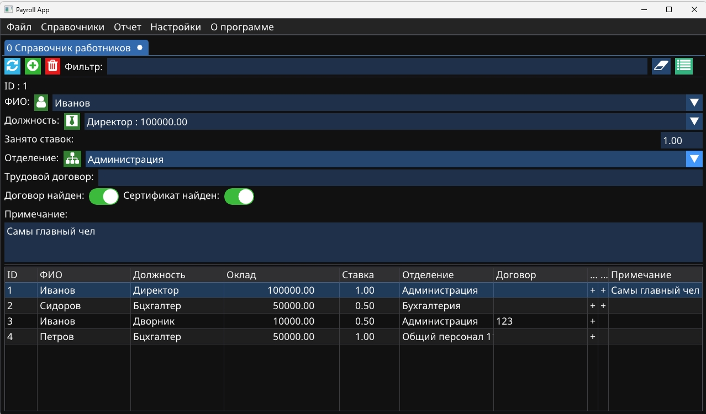

# Аудит начисления заработной платы
Пишем и изучаем IMGUI помаленьку




## настройка зависимостей
```bash
git clone -b docking https://github.com/ocornut/imgui.git  thirdparty/imgui
git clone https://github.com/aiekick/ImGuiFileDialog.git thirdparty/ImGuiFileDialog
git clone --depth=1 https://github.com/libharu/libharu.git thirdparty/libharu
git clone --depth=1 https://github.com/nlohmann/json.git thirdparty/json
git clone https://github.com/dacap/clip.git thirdparty/clip
```

## фонты
fontawesome-webfont.ttf

NotoSans-Regular.ttf

для фонтов https://fontdrop.info/


## для MSYS2
откройте MSYS2 MinGW x64 и выполните:
``` bash
pacman -Syu                          # Обновление системы
pacman -S --needed base-devel        # Базовые инструменты разработки
pacman -S mingw-w64-ucrt-x86_64-toolchain # Компилятор MinGW-w64
pacman -S mingw-w64-ucrt-x86_64-cmake     # CMake для MinGW
pacman -S mingw-w64-ucrt-x86_64-glfw      # GLFW (оконная система для ImGui)
pacman -S mingw-w64-ucrt-x86_64-icu       # для unicode/utf8.h

pacman -S git
```


## Сборка проекта:
``` bash
mkdir build && cd build
cmake ..
```
для MSYS2
``` bash
cmake -G "MinGW Makefiles" ..
```

``` bash
cmake --build . 
```


## для релиза
``` bash
cmake -G "MinGW Makefiles" -DCMAKE_BUILD_TYPE=Release ..
```

## для автономной работы
надо докинуть из каталога msys64\mingw64\bin\ библиотеки:
libwinpthread-1.dll
libgcc_s_seh-1.dll
libstdc++-6.dll


